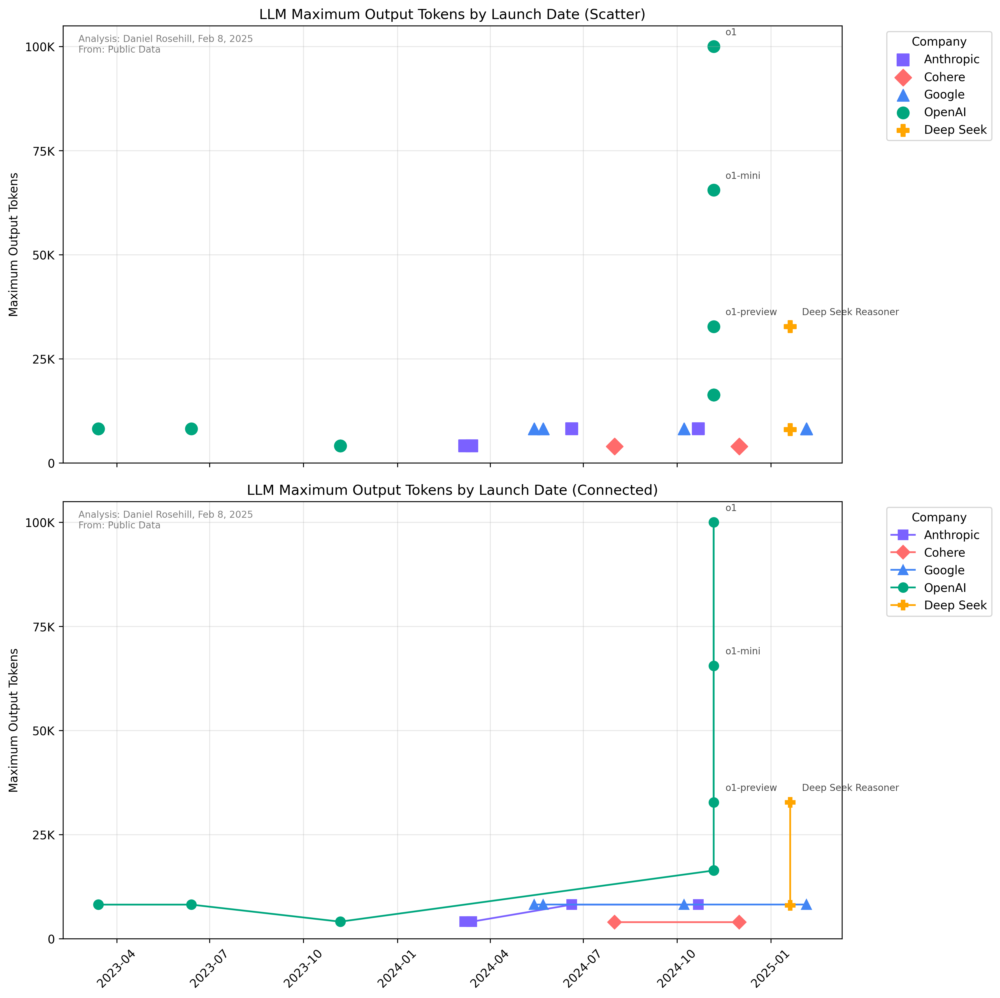

# LLMs By Max Output Token - Feb 2025

This analysis shows the evolution of maximum output tokens across different AI language models and companies. The visualization uses a logarithmic scale to better display the wide range of token values (4,000 to 100,000) and includes trend lines to show each company's progression over time. Models with 32K+ tokens are labeled directly on the plot for easy reference.

## Visualization

 
 
## Repository Structure

- `data/`: Contains the primary dataset and source data
  - `data-sources/`: Original data collected from each company's documentation
    - `anthropic/`: Anthropic model data
    - `cohere/`: Cohere model data
    - `google/`: Google model data
    - `openai/`: OpenAI model data
- `plots/`: Contains visualization outputs
- `080225/`: Contains the latest analysis and findings

## Data Table (Sorted by Maximum Output Tokens)

| Model Name | Max Output Tokens | Company | Launch Date | Max Input Tokens | Max Output as % of Max Input | Release Type |
|:-----------|------------------:|:---------|:------------|----------------:|----------------------------:|:-------------|
| o1 | 100000 | OpenAI | 2024-11-06 | 1000000 | 10.00 | Fixed |
| o1-mini | 65536 | OpenAI | 2024-11-06 | 1000000 | 6.55 | Fixed |
| Deep Seek Reasoner | 32768 | Deep Seek | 2025-01-20 | 32768 | 100.00 | Rolling |
| o1-preview | 32768 | OpenAI | 2024-11-06 | 1000000 | 3.28 | Fixed |
| chatgpt-4o-latest | 16384 | OpenAI | 2024-11-06 | 128000 | 12.80 | Fixed |
| gpt-4o-mini | 16384 | OpenAI | 2024-11-06 | 128000 | 12.80 | Fixed |
| gpt-4o | 16384 | OpenAI | 2024-11-06 | 128000 | 12.80 | Fixed |
| Gemini 2.0 Flash | 8192 | Google | 2025-02-05 | 1000000 | 0.82 | Fixed |
| Gemini 2.0 Flash-Lite Preview | 8192 | Google | 2025-02-05 | 1000000 | 0.82 | Fixed |
| gpt-4-0314 | 8192 | OpenAI | 2023-03-14 | 8192 | 100.00 | Fixed |
| gpt-4-0613 | 8192 | OpenAI | 2023-06-13 | 8192 | 100.00 | Fixed |
| gpt-4 | 8192 | OpenAI | 2023-03-14 | 8192 | 100.00 | Fixed |
| Claude 3.5 Sonnet | 8192 | Anthropic | 2024-06-20 | 200000 | 4.10 | Fixed |
| Claude 3.5 Haiku | 8192 | Anthropic | 2024-10-22 | 200000 | 4.10 | Fixed |
| Gemini 1.5 Pro | 8192 | Google | 2024-05-23 | 1000000 | 0.82 | Fixed |
| Gemini 1.5 Flash 8B | 8192 | Google | 2024-10-08 | 1000000 | 0.82 | Fixed |
| Gemini 1.5 Flash | 8192 | Google | 2024-05-14 | 1000000 | 0.82 | Fixed |
| Deep Seek V3 | 8000 | Deep Seek | 2025-01-20 | 32768 | 24.41 | Rolling |
| Claude 3 Haiku | 4096 | Anthropic | 2024-03-07 | 200000 | 2.05 | Fixed |
| Claude 3 Opus | 4096 | Anthropic | 2024-03-14 | 200000 | 2.05 | Fixed |
| gpt-4-turbo | 4096 | OpenAI | 2023-11-06 | 128000 | 3.20 | Fixed |
| gpt-4-turbo-preview | 4096 | OpenAI | 2023-11-06 | 128000 | 3.20 | Fixed |
| Claude 3 Sonnet | 4096 | Anthropic | 2024-03-14 | 200000 | 2.05 | Fixed |
| command-r-plus-08-2024 | 4000 | Cohere | 2024-08-01 | 128000 | 3.13 | Fixed |
| command-r7b-12-2024 | 4000 | Cohere | 2024-12-01 | 128000 | 3.13 | Fixed |

## Author

Daniel Rosehill  
(public at danielrosehill dot com)

## Licensing

This repository is licensed under CC-BY-4.0 (Attribution 4.0 International) 
[License](https://creativecommons.org/licenses/by/4.0/)

### Summary of the License
The Creative Commons Attribution 4.0 International (CC BY 4.0) license allows others to:
- **Share**: Copy and redistribute the material in any medium or format.
- **Adapt**: Remix, transform, and build upon the material for any purpose, even commercially.

The licensor cannot revoke these freedoms as long as you follow the license terms.

#### License Terms
- **Attribution**: You must give appropriate credit, provide a link to the license, and indicate if changes were made. You may do so in any reasonable manner, but not in any way that suggests the licensor endorses you or your use.
- **No additional restrictions**: You may not apply legal terms or technological measures that legally restrict others from doing anything the license permits.

For the full legal code, please visit the [Creative Commons website](https://creativecommons.org/licenses/by/4.0/legalcode).
